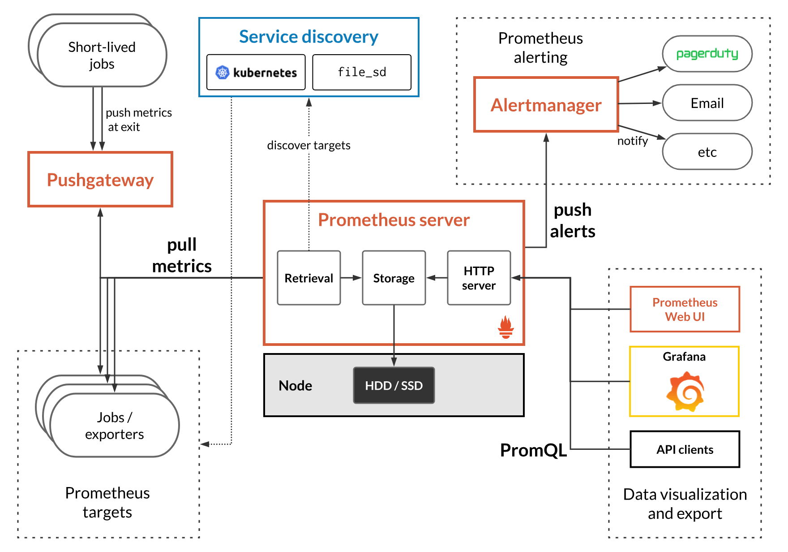
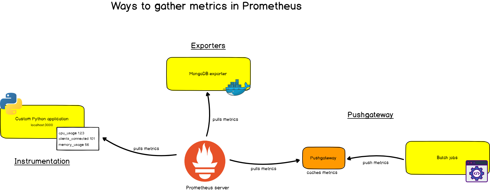

# Observability

## What is Observability?

- Logging provides insight into application-specific messages emitted by processes.
- Metrics provide quantitative information about processes running inside the system, including counters, gauges, and histograms.
- Tracing, aka distributed tracing, provides insight into the full lifecycles, aka traces, of requests to the system, allowing you to pinpoint failures and performance issues.

## Metrics & Statistics

- Push vs Pull mechanisms


> Image Credits: https://blog.pvincent.io/2017/12/prometheus-blog-series-part-3-exposing-and-collecting-metrics/

- Introspection using `/healthz`
  - [Liveness](https://kubernetes.io/docs/tasks/configure-pod-container/configure-liveness-readiness-startup-probes/) probes in K8s

## Prometheus & Grafana


> Image Credits: https://logz.io/blog/prometheus-vs-graphite/

- Prometheus [handler for Go](https://prometheus.io/docs/guides/go-application/)
- Using sidecar pattern for [kubernetes](https://www.weave.works/blog/prometheus-and-kubernetes-monitoring-your-applications/)


> Image Credits: https://devconnected.com/the-definitive-guide-to-prometheus-in-2019/

### Prometheus & Open metrics types

- Counters

*This represents a cumulative metric that only increases over time, like the number of requests to an endpoint.*

```prometheus
# HELP promhttp_metric_handler_requests_total Total number of scrapes by HTTP status code.
# TYPE promhttp_metric_handler_requests_total counter
promhttp_metric_handler_requests_total{code="200"} 0
promhttp_metric_handler_requests_total{code="500"} 0
promhttp_metric_handler_requests_total{code="503"} 0
```

- Gauge

*Gauges are instantaneous measurements of a value. They can be arbitrary values which will be recorded.*

*Gauges represent a random value that can increase and decrease randomly such as the load of your system.*

```prometheus
# HELP go_threads Number of OS threads created.
# TYPE go_threads gauge
go_threads 7
```

- Histogram

*A histogram samples observations (usually things like request durations or response sizes) and counts them in configurable buckets. It also provides a sum of all observed values.*

```prometheus
# HELP coredns_dns_request_duration_seconds Histogram of the time (in seconds) each request took.
# TYPE coredns_dns_request_duration_seconds histogram
coredns_dns_request_duration_seconds_bucket{server="dns://:53",zone=".",le="0.00025"} 30
coredns_dns_request_duration_seconds_bucket{server="dns://:53",zone=".",le="0.0005"} 53
coredns_dns_request_duration_seconds_bucket{server="dns://:53",zone=".",le="0.001"} 70
coredns_dns_request_duration_seconds_bucket{server="dns://:53",zone=".",le="0.002"} 82
coredns_dns_request_duration_seconds_bucket{server="dns://:53",zone=".",le="0.004"} 89
coredns_dns_request_duration_seconds_bucket{server="dns://:53",zone=".",le="0.008"} 104
coredns_dns_request_duration_seconds_bucket{server="dns://:53",zone=".",le="0.016"} 114
coredns_dns_request_duration_seconds_bucket{server="dns://:53",zone=".",le="0.032"} 118
coredns_dns_request_duration_seconds_bucket{server="dns://:53",zone=".",le="0.064"} 119
coredns_dns_request_duration_seconds_bucket{server="dns://:53",zone=".",le="0.128"} 119
coredns_dns_request_duration_seconds_bucket{server="dns://:53",zone=".",le="0.256"} 120
coredns_dns_request_duration_seconds_bucket{server="dns://:53",zone=".",le="0.512"} 120
coredns_dns_request_duration_seconds_bucket{server="dns://:53",zone=".",le="1.024"} 120
coredns_dns_request_duration_seconds_bucket{server="dns://:53",zone=".",le="2.048"} 120
coredns_dns_request_duration_seconds_bucket{server="dns://:53",zone=".",le="4.096"} 120
coredns_dns_request_duration_seconds_bucket{server="dns://:53",zone=".",le="8.192"} 120
coredns_dns_request_duration_seconds_bucket{server="dns://:53",zone=".",le="+Inf"} 120
coredns_dns_request_duration_seconds_sum{server="dns://:53",zone="."} 0.5653407999999996
coredns_dns_request_duration_seconds_count{server="dns://:53",zone="."} 120
```

- Summary

*Similar to a histogram, a summary samples observations (usually things like request durations and response sizes). While it also provides a total count of observations and a sum of all observed values, it calculates configurable quantiles over a sliding time window.*

```prometheus
# HELP go_gc_duration_seconds A summary of the GC invocation durations.
# TYPE go_gc_duration_seconds summary
go_gc_duration_seconds{quantile="0"} 3.291e-05
go_gc_duration_seconds{quantile="0.25"} 4.3849e-05
go_gc_duration_seconds{quantile="0.5"} 6.2452e-05
go_gc_duration_seconds{quantile="0.75"} 9.8154e-05
go_gc_duration_seconds{quantile="1"} 0.011689149
go_gc_duration_seconds_sum 3.451780079
go_gc_duration_seconds_count 13118
```

Configuring your own metrics: https://prometheus.io/docs/guides/go-application/#adding-your-own-metrics

## [OpenTelemetry](https://opentelemetry.io/)

- What is distributed tracing?
- OpenCensus + OpenTracing = OpenTelemetry
- [Specification driven](https://github.com/open-telemetry/opentelemetry-specification)
- [Go Client](https://github.com/open-telemetry/opentelemetry-go/blob/master/README.md)


> Image Credits: https://medium.com/opentelemetry/opentelemetry-beyond-getting-started-5ac43cd0fe26

### Popular Tools

- [Jaeger](https://www.jaegertracing.io/docs/1.18/)
- [Zipkin](https://zipkin.io/)
- [Appdash](https://github.com/sourcegraph/appdash)
