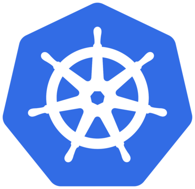
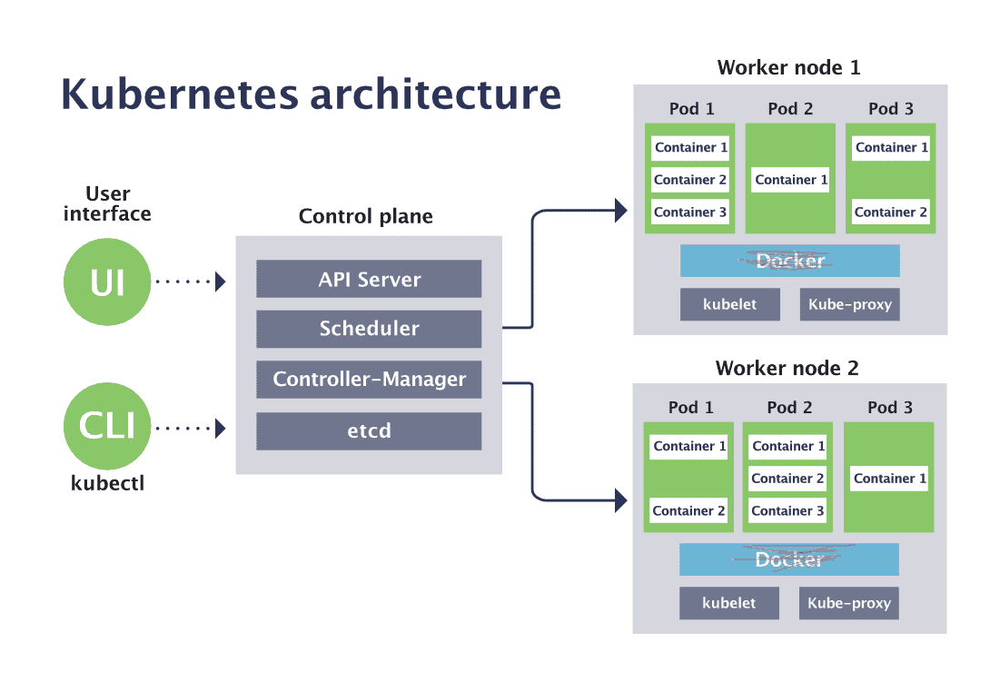
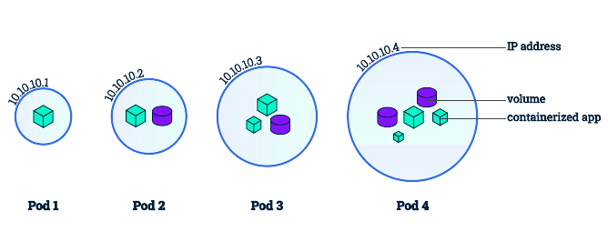
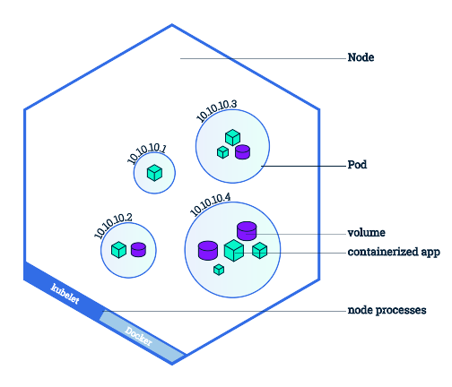
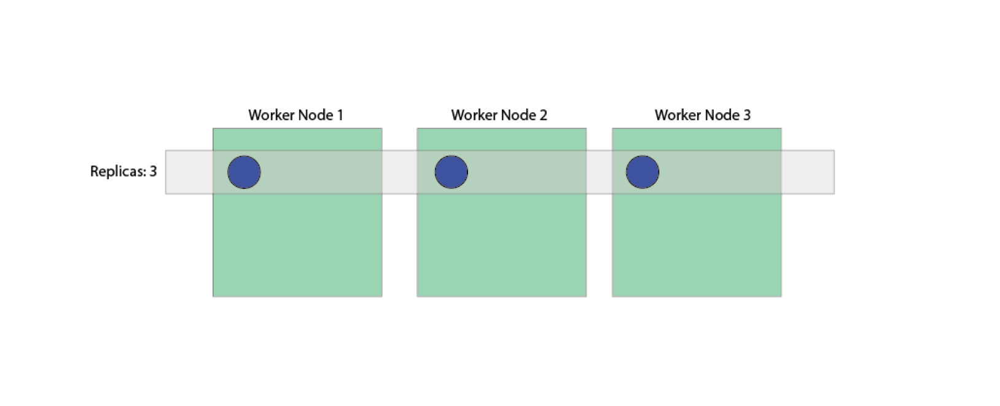
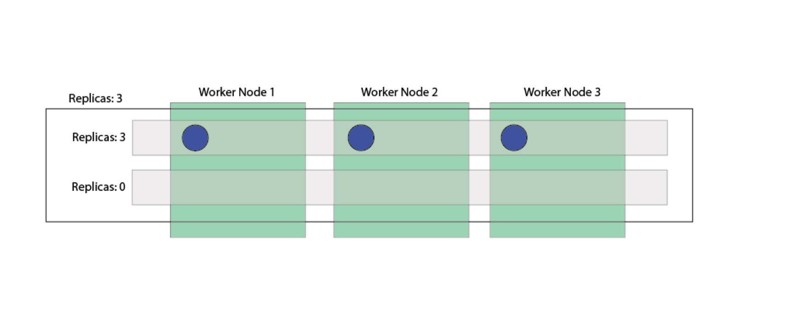
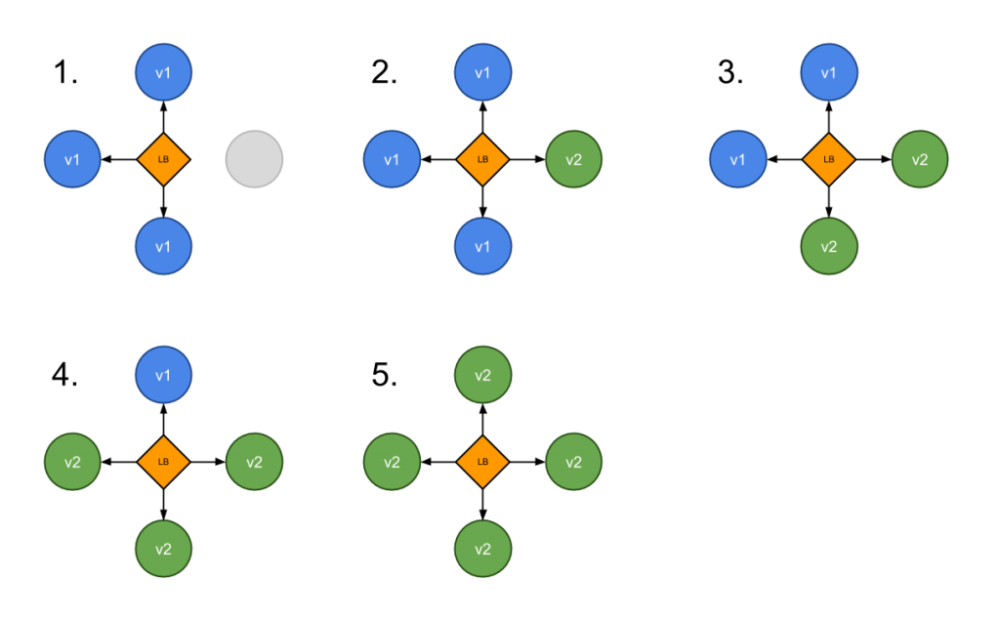
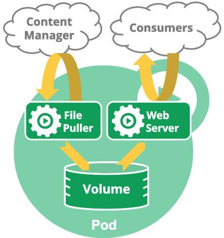

layout: true

.signature[@algogrit]

---

class: center, middle



# Kubernetes

Gaurav Agarwal

---

# [Agenda](https://github.com/AgarwalConsulting/Kubernetes-Training/blob/master/Agenda)

- Understanding the Kubernetes architecture

- Understanding built-in Workloads
  - Pods
  - Controllers
  - Storage
  - Networking
  - ...

- Managing & setting up production grade infrastructure

---

class: center, middle


Software Engineer & Product Developer

Principal Consultant & Founder @ https://agarwalconsulting.io

ex-Tarka Labs, ex-BrowserStack, ex-ThoughtWorks

---
class: center, middle

# Defining the problem

---
class: center, middle

## Thought Experiment: [Search Engine](https://github.com/AgarwalConsulting/Kubernetes-Training/blob/master/Problem.md)

---

- cluster of machines
- From ~10 to millions of microservices
- Manage/Share resources efficiently
  - Memory
  - CPU
  - Storage
  - GPU
  - ...
- Fault Tolerance
  - Healing & resiliency
- Isolation
- Networking
  - Service Discovery
- Managing Deployment
- Auto-Scaling
- ...

---
class: center, middle

# Brief History

---

- 2003 – Started at Google as The Borg System to manage Google Search. They needed a sane way to manage their large-scale container clusters! But it was still very primitive compared to what we have today. It becomes big and rather messy, with many different languages and concepts due to it’s organic growth.
- 2013 – Docker hits the scene and really revolutionizes computing by providing build tools, image distribution, and runtimes. This makes containers user friendly and adoption of containers explodes.
- 2014 – 3 Google engineers decide to build a next generation orchestrator that takes many lessons learned into account, built for public clouds, and open sourced. They build Kubernetes. Microsoft, Red Hat, IBM, and Docker join in.
- 2015 – Cloud Native Computing Foundation is created by Google and the Linux Foundation. More companies join in. Kubernetes 1.0 is released, followed by more major upgrades that year. KubeCon is launched.
- 2016 – K8S goes mainstream. Many supporting products are introduced including Minikube, kops, Helm. Rapid releases of big features. More companies join in and the community of passionate people explodes.
- 2017 to now – Kubernetes becomes the dominant orchestration system and de-facto standard for Docker microservices. K8S now has fully managed services by all major cloud providers. Handsome and talented instructors travel the country preaching K8S.

.content-credits[https://www.vergeops.com/]

---

# Running & interacting with Kubernetes locally

## Simulators

- [`minikube`](https://kubernetes.io/docs/tasks/tools/install-minikube/)
  - Restriced to a single node k8s cluster

- [`kind`](https://kind.sigs.k8s.io/docs/user/quick-start/) (preferred for this class!)
  - command line tool which allows for simulating multi node k8s cluster

## K8s CLI Tools

- [`kubectl`](https://kubernetes.io/docs/tasks/tools/install-kubectl/)
  - command line tool which lets you control Kubernetes clusters

---
class: center, middle

# Architecture


---
class: center, middle

## Components

---

- Control Plane

- Worker Plane / Nodes

- Addons

---
class: center, middle

### Control Plane Components

Control plane components can be run on any machine in the cluster. However, for simplicity, set up scripts typically start all control plane components on the same machine, and do not run user containers on this machine.

---
class: center, middle

### Worker Plane components - Nodes

Node components run on every node, maintaining running pods and providing the Kubernetes runtime environment.

---
class: center, middle

### Addons

Addons use Kubernetes resources (DaemonSet, Deployment, etc) to implement cluster features.

---
class: center, middle

# Command Line Tools

---

## `kubeadm`

- The `kubeadm` tool helps you [bootstrap](https://kubernetes.io/docs/reference/setup-tools/kubeadm/kubeadm/) a minimum viable Kubernetes cluster that conforms to best practices.

  *In fact, you can use `kubeadm` to set up a cluster that will pass the [Kubernetes Conformance tests](https://kubernetes.io/blog/2017/10/software-conformance-certification/).*

- A simple way for you to try out Kubernetes, possibly for the first time.

- A way for existing users to automate setting up a cluster and test their application.

- A building block in other ecosystem and/or installer tools with a larger scope.

.content-credits[https://kubernetes.io/docs/setup/production-environment/tools/kubeadm/create-cluster-kubeadm/]

---

## `kubectl`

- The `kubectl` command line tool lets you control Kubernetes clusters.

- For configuration, kubectl looks for a file named `config` in the `$HOME/.kube` directory.

- You can specify other kubeconfig files by setting the `KUBECONFIG` environment variable or by setting the `--kubeconfig` flag.

- Makes it reasonably easy to work with multiple clusters using: `kubectl config` & `contexts`

.content-credits[https://kubernetes.io/docs/reference/kubectl/overview/]

---
class: center, middle


.image-credits[https://www.cncf.io/blog/2019/08/19/how-kubernetes-works/]

---

class: center, middle



---
class: center, middle

So, let's get on with it...

---
class: center, middle

# Basics

---
class: center, middle

## Cluster Computing

---
class: center, middle

### Nodes

`Node = machine`

---

- Kubernetes runs your workload by placing containers into Pods to run on Nodes.
- A node may be a virtual or physical machine, depending on the cluster.
- Each node contains the services necessary to run Pods, managed by the control plane.

#### Useful commands

- `kubectl get nodes`
- `-o wide` for more information
- `kubectl describe`

---
class: center, middle

### Running our first container on a Kubernetes cluster

---
class: center, middle

`kubectl run --image=agarwalconsulting/fib-gen fibonacci`

---
class: center, middle

## Workloads

---
class: center, middle

### Pods

---

- Pods are the smallest deployable units of computing that can be created and managed in Kubernetes.

- A Pod *(as in a pod of whales or pea pod)* is a group of one or more containers *(such as Docker containers)*, with shared storage/network, and a specification for how to run the containers.

- A Pod always runs on a Node.

- Every pod gets a unique IP.

- If multiple containers per pod, pods can communicate with localhost.

#### Useful `kubectl` commands

- `kubectl get pods -o`
- `kubectl describe pods`
- `kubectl logs -f <name>`
- `kubectl exec`
- `kubectl delete pod <name>`

---
class: center, middle

#### Relation between Pods and containers



---
class: center, middle

#### Relation between Nodes and Pods



---
class: center, middle

Kubernetes supports *declarative* management of objects

---
class: center, middle

#### Writing a pod spec file

---
class: center, middle

##### [API Groups](https://kubernetes.io/docs/concepts/overview/kubernetes-api/#api-groups)

*The API group is specified in a REST path and in the apiVersion field of a serialized object.*

---

##### [Resource Limits](https://kubernetes.io/docs/concepts/configuration/manage-resources-containers/)

*When you specify a Pod, you can optionally specify how much of each resource a Container needs.*

*The most common resources to specify are **CPU** and **memory (RAM)**; there are others.*

We will look at them in more detail later.

---

#### Commands

- `kubectl apply -f ...`
- `kubectl diff -f ...`
- `kubectl delete -f ...`
- `kubectl create -f ...`

---
class: center, middle

#### Example: [Nginx-simple](https://github.com/AgarwalConsulting/Kubernetes-Training/tree/master/examples/nginx-simple)

---
class: center, middle

`kubectl port-forward ...`

---
class: center, middle

### Networking, Load Balancing & Discovery: [`service`](https://kubernetes.io/docs/concepts/services-networking/service/)

---

#### Overview

- An abstract way to expose an application running on a set of Pods as a network service.

- The service resource also lets you expose an application running in Pods to be reachable from outside your cluster.

- Containers within a Pod use networking to communicate via loopback.

---
class: center, middle

```bash
kubectl expose help # --dry-run=client -o yaml
```

---
class: center, middle

##### [Labels & Selectors](https://kubernetes.io/docs/concepts/overview/working-with-objects/labels/)

---

- Labels are key/value pairs that are attached to objects, such as pods.

- Selectors are used by controllers/services to identify pods to work with.

- Via a label selector, the client/user can identify a set of objects. The label selector is the core grouping primitive in Kubernetes.

---
class: center, middle

##### [ServiceTypes](https://kubernetes.io/docs/concepts/services-networking/service/#publishing-services-service-types)

ServiceTypes control the way in which a service is exposed.

---

- *ClusterIP*

- NodePort

- LoadBalancer

- ExternalName

---
class: center, middle

#### Exercise: Pods & Services

Write a [pod spec](https://github.com/AgarwalConsulting/Kubernetes-Training/tree/master/challenges/spring-greeting/pod.md) & [service spec](https://github.com/AgarwalConsulting/Kubernetes-Training/tree/master/challenges/spring-greeting/service.md) for the [greeting service](https://github.com/AgarwalConsulting/Kubernetes-Training/blob/master/challenges/spring-greeting).

---

#### Exercise: Service continued

- Can we access the service from our own computer at `http://localhost:<node-port>`?

- Now go delete your pod and try the URL again. Oh no! Our service is down!

- Don’t delete the service. We’ll use it again shortly.

---
class: center, middle

#### Endpoints

*Endpoints track the IP addresses of Pods with matching selectors.*

.content-credits[https://www.stackrox.io/blog/kubernetes-networking-demystified/]

---
class: center, middle

### Controllers

---

- In general, users shouldn't need to create Pods directly.
  *You will rarely interact directly with pods, except perhaps viewing logs. You will interact with Deployments or ReplicaSets instead.*

- They should almost always use controllers even for singletons, for example, Deployments.

- Controllers provide self-healing with a cluster scope, as well as replication and rollout management.

- Controllers like StatefulSet can also provide support to stateful Pods.

---

#### Natively Supported Controllers (`kind` field)

- ReplicaSet
- Deployments
- StatefulSets
- DaemonSet
- Jobs
- ...

---
class: center, middle

#### Controller Spec generators

`kubectl create --dry-run=client -o yaml`

---

##### [Supported](https://kubernetes.io/docs/reference/kubectl/conventions/#generators) Generators

```csv
clusterrole         Create a ClusterRole.
clusterrolebinding  Create a ClusterRoleBinding for a particular ClusterRole.
configmap           Create a configmap from a local file, directory or literal value.
cronjob             Create a cronjob with the specified name.
deployment          Create a deployment with the specified name.
job                 Create a job with the specified name.
namespace           Create a namespace with the specified name.
poddisruptionbudget Create a pod disruption budget with the specified name.
priorityclass       Create a priorityclass with the specified name.
quota               Create a quota with the specified name.
role                Create a role with single rule.
rolebinding         Create a RoleBinding for a particular Role or ClusterRole.
secret              Create a secret using specified subcommand.
service             Create a service using specified subcommand.
serviceaccount      Create a service account with the specified name.
```

---
class: center, middle

#### [ReplicaSet](https://kubernetes.io/docs/concepts/workloads/controllers/replicaset/)

---

- When we deleted all pods in previous exercise, our service went down!

- We don’t want to manage pods directly, because they’re mortal.

- Instead we work with *replicasets* to manage the creation and replacement of pods.

- With a *replicaset*, any pods that die will be recreated to maintain the minimum number.

- This is essentially our pod declaration with some additional meta data.

---
class: center, middle

##### Demo: Defining a replicaset for `fibonacci`

---
class: center, middle



---

##### How does it work

So what component in Kubernetes makes sure the specified number of replica pods are running? The answer shows the elegance of Kubernetes’ architecture.

- The [`ReplicationController`](https://kubernetes.io/docs/concepts/workloads/controllers/replicationcontroller/) (which is the logic behind the ReplicaSet resource) is always watching the K8s API. When it sees that the number of running pods differs from the ReplicaSet’s configuration, it takes action. It tells K8s to launch pods to make up the gap. The ReplicationController’s job is now done.

- If there are too many pods, the ReplicationController terminates the extra pods. If there are too few, the ReplicationController starts more pods.

- The pod records are created in etcd.

- The scheduler now starts finding nodes for the pods to run.

- When a pod is assigned to a node, the kubelet on the assigned node takes action to start the pod on the node.

- A `ReplicaSet` ensures that a specified number of pod replicas are running at any given time.

---

#### Exercise: ReplicaSet

- File: [examples/specs/replicaset.yaml](https://github.com/AgarwalConsulting/Kubernetes-Training/blob/master/examples/specs/replicaset.yaml)
- You can optionally: write a replicaset.yaml file for `spring-greeting` application.
- Review the file. Note the labels and replicas. Does the spec section look familiar?
- Apply the file to your cluster.
- `kubectl get all`. Note that we now have pods, services, and replicasets
- We now have our nginx pod running again! Try the URL to the service.
- Now go delete your pod. Does the service go down? Does it go down temporarily? Do a `kubectl get all` and note the name of the new pod.
- Now go increase the replicas setting in the template file and reapply.
- Repeat the pod delete step, and note that you now have a resilient service that auto heals but also has multiple pods to serve requests!
- When done, delete the replicaset.
- How do we handle updates to your container images, such as new version releases? Let’s talk deployments.

---
class: center, middle

#### [Deployments](https://kubernetes.io/docs/concepts/workloads/controllers/deployment/)

---

- `Deployments` are an abstraction that creates ReplicaSets and manages pods being launched into different ones in a controlled way.

- They are declarative and you provide the end state. Kubernetes takes care of getting your pods to that end state in a managed way.

- On a rollout, K8S creates a new replicaset and starts moving pods to the new one in a controlled way, before removing the old replicaset.

- Note: deployments create a replicaset programmatically. Do not manage the replicaset directly!

- You can see rollout status with: `kubectl rollout status deployment nginx-deployment`

- You can see rollout history with: `kubectl rollout history deployment nginx-deployment`

- You can rollback with: `kubectl rollout undo deployment nginx-deployment`

- You can pause and resume rollouts

---

##### Rollouts

- When you update the pod definition in your Deployment, the DeploymentController will start a rolling update process. It does this by simply managing ReplicaSets for you. Assume you already have code running in your Deployment.

- A new ReplicaSet is created with the new Pod configuration. The Replicas count is zero.

- The Replicas count will be increased on the new ReplicaSet.

- Once the pods are launched, the Replicas count on the original ReplicaSet are reduced.

- This process will continue until the new ReplicaSet has the original Replicas count and the old ReplicaSet has a Replicas count of zero.

- The old ReplicaSet will hang around empty. By default 10 (which is customizable in your Deployment spec). A rollback will reverse this process.

---
class: center, middle



---
class: center, middle

##### Exercise A: Write a deployment spec for the [same greeting service](https://github.com/AgarwalConsulting/Kubernetes-Training/blob/master/challenges/spring-greeting/deployment.md)

---

##### Exercise B: Deployment

- File: [examples/specs/deployment.yaml](https://github.com/AgarwalConsulting/Kubernetes-Training/blob/master/examples/specs/deployment.yaml)
- Review the file. Does it look just like a replicaset? Sure does! Note the image tag of 1.0.
- Apply it to the cluster. `kubectl get all` and note we now have pods, services, replicasets, and deployments. Your service should be back up at your cluster IP URL and will behave the same way as your replicaset did.
- Now update the deployment file to upgrade nginx from 1.0 to 2.0. When you apply it, quickly `kubectl get all`, and notice how a new replicaset and pods are created. At the URL, if you keep refreshing, you’ll see version 1 change to version 2 without the service ever going down.

---

#### Deployment Strategies

Choosing the right deployment procedure depends on the needs, listed below are some of the possible strategies to adopt:

- **Recreate**: terminate the old version and release the new one

- **RollingUpdate** or *ramped*: release a new version on a rolling update fashion, one after the other

- *blue/green*: release a new version alongside the old version then switch traffic

- *canary*: release a new version to a subset of users, then proceed to a full rollout

- *a/b testing*: release a new version to a subset of users in a precise way (HTTP headers, cookie, weight, etc.). A/B testing is really a technique for making business decisions based on statistics but we will briefly describe the process. This doesn’t come out of the box with Kubernetes, it implies extra work to setup a more advanced infrastructure (Istio, Linkerd, Traefik, custom nginx/haproxy, etc).

.content-credits[https://blog.container-solutions.com/kubernetes-deployment-strategies]

---

- RollingUpdate



---

- Blue/green is not supported by K8S. But you can still implement it yourself manually or with some scripting.

  - You can perform a blue/green deployment by using a label scheme with more than one set of labels.

- You can also do canary deployments in the same way as blue/green, but by creating a small Deployment of the new code, using common labels in your Service so that the canary pods are mixed in with original pods.

  - Once the code is vetted, then the canary Deployment can be expanded and the original Deployment reduced.

---

#### Advanced Configuration: Deployments

- We can tweak the settings of Deployments to customize their behavior.

- In the `spec`, you can specify a `strategy` for replacing old pods with new ones. The options are `Recreate` or `RollingUpdate` (default).

- With `Recreate`, all old pods are killed off before the new ones are launched. This means you’ll experience downtime.

- For `RollingUpdate`, you can adjust the behavior.
  - `maxUnavailable` specifies how many pods can be unavailable at any time during rollout. You can specify absolute number or percentage. The default is 25%.
  - `maxSurge` is how many pods can be created over the replicas count. Can be absolute or percentage. The default is 25%.
  - `minReadySeconds` specifies a waiting period before a new Pod is considered ready. For a better solution, use Probes.

---
class: center, middle

### Job

---

- Jobs are short-lived processes that create pods to fulfill the work and then cleanup the pods when done.

- You can create jobs programmatically, or have timed jobs with CronJobs.

- Great for batch operations. Think daily import processes or perhaps an inventory management process that runs periodically. Maybe a backup job.

- Keep in mind that in certain situations the schedule can create multiple jobs based on one CronJob, so design accordingly.

---

#### Exercise: `Job`

- File: [examples/specs/job.yaml](https://github.com/AgarwalConsulting/Kubernetes-Training/blob/master/examples/specs/job.yaml)

- Review the file and apply to your cluster

- Review the pods in the cluster, look at output, etc.

- Delete when done

---

#### Exercise: `CronJob`

- File: [examples/specs/cronjob.yaml](https://github.com/AgarwalConsulting/Kubernetes-Training/blob/master/examples/specs/cronjob.yaml)

- Review the file and apply to your cluster

- Review the pods in the cluster, look at output, etc.

- Questions
  - What happens when you add a sleep in the args?
  - What happens on a non-zero (failure) exit code?

- Delete when done

---
class: center, middle

### DaemonSet

---

- Runs a copy of the pod on every node in the cluster.

- Any new node will get a new copy of the pod.

- Any node removal cleans up the copy of the pod.

- Useful for system level resources such as monitoring, logging, etc.

- This is how the master pods on the worker nodes run, such as the kube-proxy and kubelet.

---
class: center, middle

### Stateful Set

---

- Works like a deployment, but provides guarantees about the order and uniqueness of pods

- Pods get a consistent naming scheme that is ordered. For example, pod-0, pod-1, pod-2, etc.

- The spec is identical, except for the Kind statement

- Stable, persistent storage

- Not typical. You should aim for stateless components if possible and use Deployments instead.

- Useful when you have a group of servers that work together and need to know each others’ names ahead of time.

- For example, we could create an ElasticSearch cluster that uses StatefulSets.

---
class: center, middle

## Configuration

---

### `configmap`

- Containers often need several environment variables to function properly so that configuration is externalized. But passing in variables directly to containers is messy.

- A ConfigMap is an API object used to store non-confidential data in key-value pairs.

- Pods can consume ConfigMaps as environment variables, command-line arguments, or as configuration files in a volume.

- This also allows you to reuse configurations.

---

### `secrets`

- How do you store sensitive information? Should you include it in a Docker image? How about in a pod spec? Never!

- Secrets are small pieces of sensitive information that your pods can access at runtime. Think passwords, SSH keys, etc.

- Secrets are stored as volumes that your containers can access. Alternatively, they can be exposed as environment variables.

- When using kubectl get, you won’t see the contents of a secret.

- Note that secrets are still accessible to those with access directly to the cluster. They are meant to protect from including them in Docker images which are more portable. It is best to have secrets managed by a limited set of people who know how to keep them safe. And don’t just check them into source control alongside your resources.

- When secrets are updated, the containers automatically pick up the changes immediately.

---

#### Exercise: `Configmap`

- File: [examples/specs/configmap.yaml](https://github.com/AgarwalConsulting/Kubernetes-Training/blob/master/examples/specs/configmap.yaml)
- Review the file and apply to your cluster
- Take a look at the log output for the MongoDB pod
- Also describe the MongoDB pod and notice the output references the configmap
- When done, delete the resources
- Port forward: `kubectl port-forward pod/mongodb-deployment-xxx 27017:27017`
- Connection string: `mongodb://<username>:<password>@localhost/admin`

---

#### Exercise: `secret`

- File: [examples/specs/secret.yaml](https://github.com/AgarwalConsulting/Kubernetes-Training/blob/master/examples/specs/secret.yaml)
- Review the file and apply to your cluster
- Take a look at the log output for the MongoDB pod
- Also describe the MongoDB pod and notice the output references the secret. Also notice that it was mounted as a volume to the container for you.
- When done, delete the resources.

Note: for simplicity, the secret and deployment are together. Don’t do this in a real world scenario.

---

class: center, middle

## [Storage](https://github.com/AgarwalConsulting/Kubernetes-Training/blob/master/notes/storage.md)

---
class: center, middle

### Volumes

---

- On-disk files in a Container are ephemeral, which presents some problems for non-trivial applications when running in Containers.

- First, when a Container crashes, kubelet will restart it, but the files will be lost - the Container starts with a clean state.

- Second, when running Containers together in a Pod it is often necessary to share files between those Containers.

- The Kubernetes Volume abstraction solves both of these problems.

---

#### Comparison with Docker Volumes

- Docker also has a concept of volumes, though it is somewhat looser and less managed.
- In Docker, a volume is simply a directory on disk or in another Container.
- Lifetimes are not managed and until very recently there were only local-disk-backed volumes.
- Docker now provides volume drivers, but the functionality is very limited for now (as of v1.7).

#### Kubernetes Volumes

- A Kubernetes volume, on the other hand, has an explicit lifetime - the same as the Pod that encloses it.
- Consequently, a volume outlives any Containers that run within the Pod, and data is preserved across Container restarts.
- Of course, when a Pod ceases to exist, the volume will cease to exist, too.
- At its core, a volume is just a directory, possibly with some data in it, which is accessible to the Containers in a Pod.

---

- How that directory comes to be, the medium that backs it, and the contents of it are determined by the particular volume type used.

- Volumes can be a variety of types, from the host hard drive to cloud storage volumes like AWS EBS.

- To read up on the details: https://kubernetes.io/docs/concepts/storage/volumes/

- K8S volumes include lots of management automatically, such as mounting your EBS volumes to pods and unmounting them.

- This topic can get messy. We’re going to dive into more depth on it later when we create our infrastructure on a cloud.

---
class: center, middle

# Intermediate

---
class: center, middle

## Isolation

---
class: center, middle

### Namespaces

---

- Kubernetes supports multiple virtual clusters backed by the same physical cluster.

  *These virtual clusters are called namespaces.*

- Namespaces are intended for use in environments with many users spread across multiple teams, or projects.

- Namespaces provide a scope for names. Names of resources need to be unique within a namespace, but not across namespaces.

- Namespaces cannot be nested inside one another and each Kubernetes resource can only be in one namespace.

- Namespaces are a way to [divide cluster resources between](https://kubernetes.io/docs/concepts/policy/resource-quotas/) multiple users.

.content-credits[https://kubernetes.io/docs/concepts/overview/working-with-objects/namespaces/]

---

Kubernetes starts with four initial namespaces:

- `default`: The default namespace for objects with no other namespace

- `kube-system`: The namespace for objects created by the Kubernetes system

- `kube-public`: This namespace is created automatically and is readable by all users (including those not authenticated). This namespace is mostly reserved for cluster usage, in case that some resources should be visible and readable publicly throughout the whole cluster. The public aspect of this namespace is only a convention, not a requirement.

- `kube-node-lease`: This namespace for the lease objects associated with each node which improves the performance of the node heartbeats as the cluster scales.

.content-credits[https://kubernetes.io/docs/concepts/overview/working-with-objects/namespaces/]

---
class: center, middle

## Reusable apps & Multitenancy

---
class: center, middle

## Multitenancy

Multitenancy is a reference to the mode of operation of software where multiple independent instances of one or multiple applications operate in a shared environment.

---

### Approaches

- Kubernetes [Operators](https://coreos.com/operators/)
- [Helm](https://helm.sh/)

---
class: center, middle

### [Helm](https://helm.slides.algogrit.com/)

---
class: center, middle

## [Provisioning a K8s cluster](https://github.com/AgarwalConsulting/Kubernetes-Training/tree/master/notes/provisioning.md)

---

### Options

- Using [`kubeadm`](https://kubernetes.io/docs/setup/production-environment/tools/kubeadm/create-cluster-kubeadm/)
  - [HA Cluster](https://kubernetes.io/docs/setup/production-environment/tools/kubeadm/high-availability/)

- [Kubernetes The Hard Way](https://github.com/kelseyhightower/kubernetes-the-hard-way) by Kelsey Hightower

- Using [`kops`](https://kubernetes.io/docs/setup/production-environment/tools/kops/)

- Or managed kubernetes...

---
class: center, middle

#### Demo: Setting up a cluster the hard-way on GCP

---
class: center, middle

#### Exercise: Setting a multi-node cluster [on Katacoda](https://www.katacoda.com/courses/kubernetes/getting-started-with-kubeadm)

---
class: center, middle

## Kubernetes concepts in depth

---
class: center, middle

### Services, Load balancing & Networking

---

#### Services without selectors

Services most commonly abstract access to Kubernetes Pods, but they can also abstract other kinds of backends. For example:

- You want to have an external database cluster in production, but in your test environment you use your own databases.

- You want to point your Service to a Service in a different Namespace or on another cluster.

- You are migrating a workload to Kubernetes. Whilst evaluating the approach, you run only a proportion of your backends in Kubernetes.

.content-credits[https://kubernetes.io/docs/concepts/services-networking/service/]

---
class: center, middle

##### Demo: Exposing an externally running service within the cluster

---
class: center, middle

#### [Ingress](https://kubernetes.io/docs/concepts/services-networking/ingress)

*An API object that manages external access to the services in a cluster, typically HTTP.*

---

- Ingress exposes HTTP and HTTPS routes from outside the cluster to services within the cluster. Traffic routing is controlled by rules defined on the Ingress resource.

- An Ingress may be configured to give Services externally-reachable URLs, load balance traffic, terminate SSL / TLS, and offer name based virtual hosting. An Ingress controller is responsible for fulfilling the Ingress, usually with a load balancer, though it may also configure your edge router or additional frontends to help handle the traffic.

- An Ingress does not expose arbitrary ports or protocols. Exposing services other than HTTP and HTTPS to the internet typically uses a service of type `Service.Type=NodePort` or `Service.Type=LoadBalancer`.

- Popular use is to centralize many microservices under one name using routing rules (AKA edge service or API gateway). For example:

  - `example.com/account` - points to account service
  - `example.com/orders` - points to order service

- Other solutions exist for this. For example, cloud providers have their own L7 load balancers such as Application Load Balancer from AWS. Ingress is just the K8S solution. You can also do it internally with your own app like we will do in the hackathon portion.

.content-credits[https://kubernetes.io/docs/concepts/services-networking/ingress/]

---

##### Prerequisites

- You must have an ingress controller to satisfy an Ingress. Only creating an Ingress resource has no effect.

- You may need to deploy an Ingress controller such as ingress-nginx. You can choose from a number of [Ingress controllers](https://kubernetes.io/docs/concepts/services-networking/ingress-controllers/).

- Ideally, all Ingress controllers should fit the reference specification. In reality, the various Ingress controllers operate slightly differently.

---
class: center, middle

##### Demo: Ingress Controller

Let's deploy [`nginx-ingress` controller](https://docs.nginx.com/nginx-ingress-controller/installation/installation-with-helm/), using `helm`

---
class: center, middle

##### Demo: Ingress

Review an existing [ingress resource](https://github.com/algogrit/yaes-server/blob/master/devops/k8s/ingress.yaml)

---
class: center, middle

##### Exercise: Write an [ingress spec](https://github.com/AgarwalConsulting/Kubernetes-Training/tree/master/challenges/spring-greeting/ingress.md) for `spring-greeting`

---

##### Using [multiple Ingress controllers](https://github.com/kubernetes/ingress-gce/blob/master/docs/faq/README.md#how-do-i-run-multiple-ingress-controllers-in-the-same-cluster)

You may deploy any number of ingress controllers within a cluster. When you create an ingress, you should annotate each ingress with the appropriate ingress.class to indicate which ingress controller should be used if more than one exists within your cluster.

If you do not define a class, your cloud provider may use a default ingress controller.

---

class: center, middle

### Advanced Pods

---

class: center, middle

#### Composite Pods

---
class: center, middle

##### [Init Containers](https://kubernetes.io/docs/concepts/workloads/pods/init-containers/) & Sidecars

*Pods in a Kubernetes cluster can be used in two main ways: Single container, multiple containers.*

---

##### Init containers overview

- Init containers run and complete before the app containers are started.
- Init containers always run to completion.
- Each init container must complete successfully before the next one starts.
- Application containers (or app containers) are the containers in a pod that are started after any init containers have completed.
- Migrations are a good example of this. Eg: [Yaes Server](https://github.com/algogrit/yaes-server/blob/master/devops/k8s/service.yaml#L19)

##### Sidecar overview

- Usually you want to have a pod contain just a single container.
- However, there are cases when you’d want to have multiple containers in a single pod.
- The sidecar pattern is an example of this.
- With a sidecar, you run a second container in a pod whose job is to take action and support the primary container.
- Logging is a good example, where a sidecar container sends logs from the primary container to a centralized logging system.

---
class: center, middle

##### Demo: Init container - [migration](https://github.com/algogrit/yaes-server)

---
class: center, middle

*For example, you might have a container that acts as a web server for files in a shared volume, and a separate "sidecar" container that updates those files from a remote source.*



.image-credits[https://kubernetes.io/docs/concepts/workloads/pods/pod-overview/]

---

##### Exercise: Sidecar

- File: [examples/specs/logshipper.yaml](https://github.com/AgarwalConsulting/Kubernetes-Training/blob/master/examples/specs/logshipper.yaml)
- Let’s apply it
- Review all pods
- Describe the pod

---
class: center, middle

#### [Probes](https://github.com/AgarwalConsulting/Kubernetes-Training/blob/master/notes/workloads/probes.md)

---

- A Probe is a diagnostic performed periodically by the kubelet on a Container.

- Pods and their containers can misbehave. We need to have a way to control how Kubernetes handles them.

- When a pod becomes unhealthy, we want Kubernetes to be able to restart it.

- Because pods and their containers don’t start up immediately, we want Kubernetes to hold traffic from hitting the pod until it is ready.

---

The kubelet can optionally perform and react to three kinds of probes on running Containers:

- `livenessProbe`: Indicates whether the [Container is running](https://kubernetes.io/docs/concepts/workloads/pods/pod-lifecycle/#when-should-you-use-a-liveness-probe). If the liveness probe fails, the kubelet kills the Container, and the Container is subjected to its restart policy.

- `readinessProbe`: Indicates whether the [Container is ready to service requests](https://kubernetes.io/docs/concepts/workloads/pods/pod-lifecycle/#when-should-you-use-a-readiness-probe). If the readiness probe fails, the endpoints controller removes the Pod's IP address from the endpoints of all Services that match the Pod. The default state of readiness before the initial delay is Failure.

- `startupProbe`: Indicates whether the [application within the Container is started](https://kubernetes.io/docs/concepts/workloads/pods/pod-lifecycle/#when-should-you-use-a-startup-probe). All other probes are disabled if a startup probe is provided, until it succeeds. If the startup probe fails, the kubelet kills the Container, and the Container is subjected to its restart policy.

If a Container does not provide a liveness, readiness or startup probe, the respective probes default state is Success. [Documentation on configuration here](https://kubernetes.io/docs/tasks/configure-pod-container/configure-liveness-readiness-startup-probes/).

---

##### Exercise A: Probes

In this exercise, a nginx container starts, but after 30 seconds the index.html file is removed, which causes nginx to no longer return a 200 status code. The probe will pick up on that and restart the container, starting the process over.

- File: [examples/specs/probe.yaml](https://github.com/AgarwalConsulting/Kubernetes-Training/blob/master/examples/specs/probe.yaml)
- Review the template file. Notice there are two resources in this one!
- Apply to your cluster.
- Open a browser and verify that you can access it.
- `kubectl get all`. Notice the pod’s restarts column.
- `kubectl describe pod liveness-http`, and notice the output shows the restarts
- When done, delete the resources using the template file.

  `kubectl delete –f probe.yaml`

---

##### Exercise B: Probes

Now let’s add a readiness probe so that traffic doesn’t get sent to a down pod. This lab includes the same pod from the last lab, but as a deployment with several copies. It has an initContainer that randomly sleeps before starting the main pod.

- File: [examples/specs/probe-2.yaml](https://github.com/AgarwalConsulting/Kubernetes-Training/blob/master/examples/specs/probe-2.yaml)
- Review the template file.
- Apply to your cluster.
- Open a browser and verify that you can access it.
- After about a minute, you should no longer get a valid response from any pod, because they all get the index.html file removed.
- Now update the deployment ([documentation](https://kubernetes.io/docs/tasks/configure-pod-container/configure-liveness-readiness-startup-probes/)) to contain both a readiness probe (to remove the pod from service when it goes down) and a liveness probe (to restart the container when it fails).
- Run a watch `kubectl get all`, and watch the pods as they restart. Notice how the status goes back and forth between 1/1 and 0/1.
- In a new terminal tab, run a watch `kubectl describe service nginx-service`. Notice the endpoints shifting as the service shuffles pods in and out of service based on their readiness probe status.
- You should now have a resilient service that stays up. It might occasionally go down if all three pods are broken at the same time. But you get the idea.

---
class: center, middle

#### [Scheduling](https://github.com/AgarwalConsulting/Kubernetes-Training/blob/master/notes/workloads/scheduling.md)

---
class: center, middle

*In Kubernetes, scheduling refers to making sure that Pods are matched to Nodes so that `kubelet` can run them.*

---

##### Scheduling problem

- In our cluster, we want to treat our nodes as generic commodities of compute power. But in reality, not all compute is equal. Different attributes of a server make it more suitable for some workloads.

  - An application may need a GPU, or fast SSDs, or high network bandwidth, or high memory.
  - We may want pods to run on cloud servers or on-premise servers.
  - You may want pods that need to run physically close to each other (in the same availability zone) to minimize data traffic.

- We need a way to tell our cluster which nodes are acceptable for which pods.

---

- `kube-scheduler` is the default scheduler for Kubernetes and runs as part of the control plane. `kube-scheduler` is designed so that, if you want and need to, you can write your own scheduling component and use that instead.

- A scheduler watches for newly created Pods that have no Node assigned. For every Pod that the scheduler discovers, the scheduler becomes responsible for finding the best Node for that Pod to run on.

- In a cluster, Nodes that meet the scheduling requirements for a Pod are called feasible nodes. If none of the nodes are suitable, the pod remains unscheduled until the scheduler is able to place it.

- kube-scheduler selects a node for the pod in a 2-step operation:

  - Filtering
  - Scoring

---

##### Assigning Pods to Nodes

- You can constrain a Pod to only be able to run on particular Node(s), or to prefer to run on particular nodes. There are several ways to do this, and the recommended approaches all use label selectors to make the selection.

- Just like pods, nodes can have labels too.

- Add a label to a node

  `kubectl label nodes <node-name> <label-key>=<label-value>`

- Remove a label

  `kubectl label nodes <node-name> <label-key>-`

- `nodeSelector` is the simplest recommended form of node selection constraint. nodeSelector is a field of PodSpec. It specifies a map of key-value pairs.

---

##### Exercise: `nodeSelector`

- File: [examples/specs/nodeselector.yaml](https://github.com/AgarwalConsulting/Kubernetes-Training/blob/master/examples/specs/nodeselector.yaml)
- Review the file and apply it to your cluster.
- Look at the state of your cluster. Did the pod schedule onto your node? Go find the exact cause.
- Now apply the necessary label to your node to make the pod schedule.
- Review the details to verify that it schedules successfully.

---

##### Node affinity/anti-affinity

- `nodeSelector` provides a very simple way to constrain pods to nodes with particular labels. The affinity/anti-affinity feature, greatly expands the types of constraints you can express. The key enhancements are

- Node `affinity` is conceptually similar to `nodeSelector` -- it allows you to constrain which nodes your pod is eligible to be scheduled on, based on labels on the node.

- Affinity properties are specified in the pod spec separately from the nodeSelector.

---

- There are currently two types of node affinity, called `requiredDuringSchedulingIgnoredDuringExecution` and `preferredDuringSchedulingIgnoredDuringExecution`.

- You can think of them as "hard" and "soft" respectively, in the sense that the former specifies rules that must be met for a pod to be scheduled onto a node (just like nodeSelector but using a more expressive syntax), while the latter specifies preferences that the scheduler will try to enforce but will not guarantee.

- Thus an example of `requiredDuringSchedulingIgnoredDuringExecution` would be "only run the pod on nodes with Intel CPUs" and an example `preferredDuringSchedulingIgnoredDuringExecution` would be "try to run this set of pods in failure zone XYZ, but if it's not possible, then allow some to run elsewhere".

- Node affinity is specified as field `nodeAffinity` of field `affinity` in the PodSpec.

- The new node affinity syntax supports the following operators: `In`, `NotIn`, `Exists`, `DoesNotExist`, `Gt`, `Lt`.

---

##### Exercise: Node affinity lab

- File: [examples/specs/affinity.yaml](https://github.com/AgarwalConsulting/Kubernetes-Training/blob/master/examples/specs/affinity.yaml)
- Remove the label created in the last lab with:
  `kubectl label node docker-desktop storagetype-`
- Predict the behavior when you apply the file. Apply it.
- Apply the necessary label to make the pod schedule.
- Note that there was a preferred requirement for storagetype but the pod still gets scheduled if it isn’t present.

---

##### Inter-pod affinity and anti-affinity

Inter-pod affinity and anti-affinity allow you to constrain which nodes your pod is eligible to be scheduled based on labels on pods that are already running on the node rather than based on labels on nodes.

- The rules are of the form "this pod should (or, in the case of anti-affinity, should not) run in an X if that X is already running one or more pods that meet rule Y".

- Y is expressed as a `LabelSelector` with an optional associated list of namespaces; unlike nodes, because pods are namespaced (and therefore the labels on pods are implicitly namespaced), a label selector over pod labels must specify which namespaces the selector should apply to.

- Inter-pod affinity is specified as field `podAffinity` of field `affinity` in the PodSpec. And inter-pod `anti-affinity` is specified as field `podAntiAffinity` of field `affinity` in the PodSpec.

---

##### Exercise: Inter-pod affinity

- File: [examples/specs/inter-pod-affinity.yaml](https://github.com/AgarwalConsulting/Kubernetes-Training/blob/master/examples/specs/inter-pod-affinity.yaml)
- Review the file and apply it to your cluster.
- Look at the state of your cluster. Did the pod schedule onto your node? Go find the exact cause.
- Now create other pods with appropriate labels to schedule the pods.
- Review the details to verify that it schedules successfully.

---
class: center, middle

##### Taints and Tolerations

---

##### Taints

- Node affinity, is a property of Pods that attracts them to a set of nodes. Taints are the opposite -- they allow a node to repel a set of pods.

- You add a taint to a node using `kubectl taint`. For example,

  `kubectl taint nodes <node-name> key=value:NoSchedule`

- To remove the taint added by the command above, you can run:

  `kubectl taint nodes <node-name> key:NoSchedule-`

---

##### Tolerations

- Tolerations are applied to pods, and allow (but do not require) the pods to schedule onto nodes with matching taints.

- Taints and tolerations work together to ensure that pods are not scheduled onto inappropriate nodes. One or more taints are applied to a node; this marks that the node should not accept any pods that do not tolerate the taints.

- You specify a toleration for a pod in the PodSpec using `tolerations`.

- The default value for operator is `Equal`.

- A toleration "matches" a taint if the keys are the same and the effects are the same, and:

  - the operator is `Exists` (in which case no value should be specified), or
  - the operator is `Equal` and the values are equal.

---

##### Exercise: Taints & tolerations

- File: [examples/specs/taints.yaml](https://github.com/AgarwalConsulting/Kubernetes-Training/blob/master/examples/specs/taints.yaml)
- Give your node a taint to allow the first pod to schedule on your node but prevent the second pod from scheduling on the node.
- Describe your node and verify that the taint is in place.
- Apply the file to your cluster.
- Review the pod. You should find that the second pod didn’t schedule. However, the first pod should schedule.
- Now add a taint to evict the first pod. It should be removed after 30 seconds.
- Now remove the taints. The second generic pod should now schedule.
- When done delete the resources.

---
class: center, middle

### Advanced Configuration

---
class: center, middle

#### [Resource Constraints](https://kubernetes.io/docs/concepts/configuration/manage-resources-containers/)

---

- To properly manage your Kubernetes clusters, it’s important to carefully manage resource usage.

- When you specify a Pod, you can optionally specify how much of each resource a Container needs. The most common resources to specify are CPU and memory (RAM); there are others.

- There are two resource types in Kubernetes: CPU and memory

  - CPU is expressed in units of a CPU core. Either a decimal or with the xxxm format. For example, 0.1 and 100m mean the same thing, or ten percent. The second format is referred to as “millicores”.
  - Memory is express in bytes, kilobytes, megabytes, etc. The notation is xxMi, xxGi, etc. Note that the units aren’t exactly megabyte, gigabyte, etc. They’re actually mebibyte, gibibyte, etc. But they’re so close that it’s not worth worrying about.

- Resources are specified on containers, not pods. The resources for a pod is simply the sum of all containers specified for it.

---

##### `requests` & `limits`

- There are two ways Kubernetes controls resources such as CPU and memory:

  - Requests – This is the value the container is guaranteed to get when it’s pod is scheduled. If the scheduler can’t find a node with this amount, then the pod wont get scheduled.
  - Limits – This it the limit placed on the CPU or memory. The container will never use more than this.

- Requests can never be higher than limits. Kubernetes will throw an error.

- These values are assigned to containers, not pods.

---

##### Sample: `requests` & `limits`

```yaml
containers:
  - name: container1
    image: myimage:v1
    resources:
      requests:
        memory: “64Mi”
        cpu: ”200m”
      limits:
        memory: “128Mi”
        cpu: “600m”
 - name: container2
    image: myotherimage:v1
    resources:
      requests:
        memory: “32Mi”
        cpu: ”100m”
      limits:
        memory: “64Mi”
        cpu: “300m”
```

> Total for pod

Total CPU request: 300 millicore
Total memory request: 96 Mi

Total CPU limit: 900 millicore
Total memory limit: 192 Mi

---

> What happens when you don’t specify a CPU limit?

- The container has no upper bound, and could use all of the available CPU available on it’s node.

- If the namespace has a default limit, then it will inherit that.

---

##### `namespace` settings

- In an ideal world, everyone will behave and set their limits appropriately.

- But in reality, people forget to put proper limits, or make limits that are too high. Engineers tend to overprovision because it’s easier than managing things. They may set requests and limits that are higher than their fair share and waste node capacity.

- To prevent this, you can set ResourceQuotas and LimitRanges at the namespace level.

---

##### `ResourceQuota`

`ResourceQuotas` set limits for all containers in the namespace. Note this is not a per node quota.

- You can use this to keep a team in check for example. If you have several teams using the same Kubernetes cluster, then this prevents any one team from consuming too many CPU and memory units.

  - Requests.cpu – this is the total requests for CPU for all containers in the namespace.
  - Requests.memory – this is the total requests for memory for all containers in the namespace.
  - Limits.cpu – the total limits for all containers in the namespace
  - Limits.memory – the total limits for all containers in the namespace

---
class: center, middle

##### Example: [ResourceQuota](https://github.com/AgarwalConsulting/Kubernetes-Training/blob/master/examples/specs/resources/resourcequota.yaml)

---

##### `LimitRange`

Unlike a quota, a LimitRange applies to any container rather than the total for all containers in a namespace.

- This can prevent people from creating super small or super large containers. You can set the minimum and maximum values to ensure that all containers are given reasonable limits.

- `Default` sets default CPU and memory limit settings if they aren’t specified for a container in a pod.

- `defaultRequest` sets the default requests for CPU and memory if they aren’t specified for a container in a pod.

- `min` and `max` set the limits on an individual container.

---
class: center, middle

##### Example: [LimitRange](https://github.com/AgarwalConsulting/Kubernetes-Training/blob/master/examples/specs/resources/limitrange.yaml)

---

##### Resource based scheduling

- At the time a pod is scheduled, the scheduler runs checks on nodes to determine if enough capacity exists. CPU and memory is finite on a node, and that capacity is used up, or “reserved” by the existing pods.

- While actual CPU and memory usage will be lower, the scheduler uses the maximum specified to give room for load later.

- If there is less resource available on a node than the pod requests, then the placement is refused and Kubernetes looks at the next node.

- If Kubernetes can’t find a suitable home for a pod, then the pod goes into a “pending” state.

- When Kubernetes places a pod on a node, these resource specifications are handed off to the container runtime (Docker run command).

---
class: center, middle

### Security

---

#### The 4C's of Cloud Native security


.image-credits[https://kubernetes.io/docs/concepts/security/overview/]

---

*You can think about security in layers.*

The 4C's of Cloud Native security are:

- Cloud
- Clusters
- Containers
- Code

---

##### Cloud / Infrastructure layer

In many ways, the Cloud (or co-located servers, or the corporate datacenter) is the trusted computing base of a Kubernetes cluster.

If the Cloud layer is vulnerable then there is no guarantee that the components built on top of this base are secure. Each cloud provider makes security recommendations for running workloads securely in their environment.

##### Containers

Here are general recommendations and links to explore this topic:

- Container Vulnerability Scanning and OS Dependency Security
- Image Signing and Enforcement
- Disallow privileged users

*Container & cloud security is outside the scope of this training.*

---

##### Code

Since time immemorial *(or since http was invented)*, there are various ways of authenticating any incoming request to a server:

- Basic Auth

  With [basic auth](https://github.com/AgarwalConsulting/Go-Training/tree/master/examples/11-A-01-net/auth/basic) you have credentials sent over http headers, verfied server side.

- Cookies

  A cookie is basically just an item in a dictionary. Each item has a key and a value. For authentication, the key could be something like 'username' and the value would be the username. Each time you make a request to a website, your browser will include the cookies in the request, and the host server will check the cookies. So authentication can be done automatically like that.

  A browser will save the cookies set by the server. In the HTTP header of every request the browser makes to that server, it will add the cookies.

*Both these methods are increasingly outdated.*

.content-credits[https://stackoverflow.com/a/17769061/1268651]

---
class: center, middle

###### [JWT](https://jwt.io/)

---
class: center, middle

###### Demo: JWT API in [Go](https://github.com/AgarwalConsulting/Go-Training/tree/master/examples/11-A-01-net/auth/jwt)

---

#### Cluster Security

There are two areas of concern for securing Kubernetes:

- Securing the cluster components that are configurable
- Securing the applications which run in the cluster

---

##### Components of the Cluster

If you want to protect your cluster from accidental or malicious access and adopt good information practices, read and follow the advice about [securing your cluster](https://kubernetes.io/docs/tasks/administer-cluster/securing-a-cluster/).

*We would be covering this in detail in a more advanced class when we would be [setting up a K8s cluster](https://kubernetes.io/docs/concepts/cluster-administration/) the hard way.*

---
class: center, middle

##### [Components in the cluster](https://kubernetes.io/docs/concepts/security/overview/#cluster-applications)

---

##### Problem

Working with Kubernetes as an administrator is easy. But in production, we need to:

- Have different users with different privileges
- Have full, granular control over what privileges those users have
- Have full, granular control over processes in our cluster
- Limit visibility to some users

---
class: center, middle

###### RBAC

---

- We have a few key concepts:

  - Subjects – users and processes that want to access Kubernetes
  - API resources – Kubernetes objects like pods, services, etc.
  - Verbs – The set of operations that can be executed on the resources.

- `RBAC` is all about controlling what users and processes (subjects) can perform operations (verbs) on specific resources.

- `RBAC` objects:

  - `Roles` – Will connect API resources and verbs. These are reusable.
  - `RoleBindings` – Will connect Roles to subjects

---
class: center, middle

###### Demo: [Creating a user](https://github.com/AgarwalConsulting/Kubernetes-Training/tree/master/notes/rbac.md)

---

###### roles

- With just a user, you can’t do anything. Users are given no permissions by default.

- We need a role applied to the user to allow this user to actually do something.

- A role is where we specify what operation can be done against what resource. A role does NOT specify WHO.

- Roles are scoped to a namespace. To give permission to resources at the cluster level (like nodes), there is a ClusterRole object, which closely resembles a Role.

---

###### Exercise: `roles`

Let’s create a role that will give testuser access to limited functionality.

- File: [examples/rbac/devrole.yaml](https://github.com/AgarwalConsulting/Kubernetes-Training/blob/master/examples/rbac/devrole.yaml)
- Inspect the file and notice what resources and verbs it allows.

  - What resources will this role allow access to?
  - What actions will the subject (user) be able to perform on those resources?

- Apply the file to the cluster
- At this point we still don’t have access for testuser. For that we need a RoleBinding.

---

###### `rolebindings`

- RoleBindings tie a subject (user) to a role.
- There is also ClusterRoleBinding which is used to grant permissions at the cluster level.

---

###### Exercise: `rolebindings`

Let’s tie the Role we created in the last lab to our testuser.

- File: [examples/rbac/devrolebinding.yaml](https://github.com/AgarwalConsulting/Kubernetes-Training/blob/master/examples/rbac/devrolebinding.yaml)
- Inspect the file.
- Apply the file to the cluster
- With this in place, we can now access the cluster with our testuser.
- To test the user, switch your kubectl context over to testuser and attempt to do some operations. Perhaps apply one of the pods in the exercise files. You should only be allowed to do the operations allowed in the Role that was created in the last lab.
- Try modifying the role and see how it impacts testuser.

---

###### `serviceaccounts`

- Like Users, these are Subjects, but live inside the cluster and are namespaced.

- Meant for processes that run in Pods.

- For example, if you wrote a custom controller that interacts with the Kubernetes API, it will need to have controlled access to certain API resources.

  - If you wrote a BlueGreenDeployment controller, what API resources would it need access to? And what actions would it need?

- We won’t do a lab on this as it is much more involved.

---
class: center, middle

## SRE / [Observability](https://github.com/AgarwalConsulting/Kubernetes-Training/tree/master/notes/observability.md)

---
class: center, middle

# Hackathon: [RVStore](https://github.com/AgarwalConsulting/Kubernetes-Training/tree/master/challenges/rvstore)

---
class: center, middle

Code
https://github.com/AgarwalConsulting/Kubernetes-Training

Slides
https://k8s.slides.agarwalconsulting.io/
